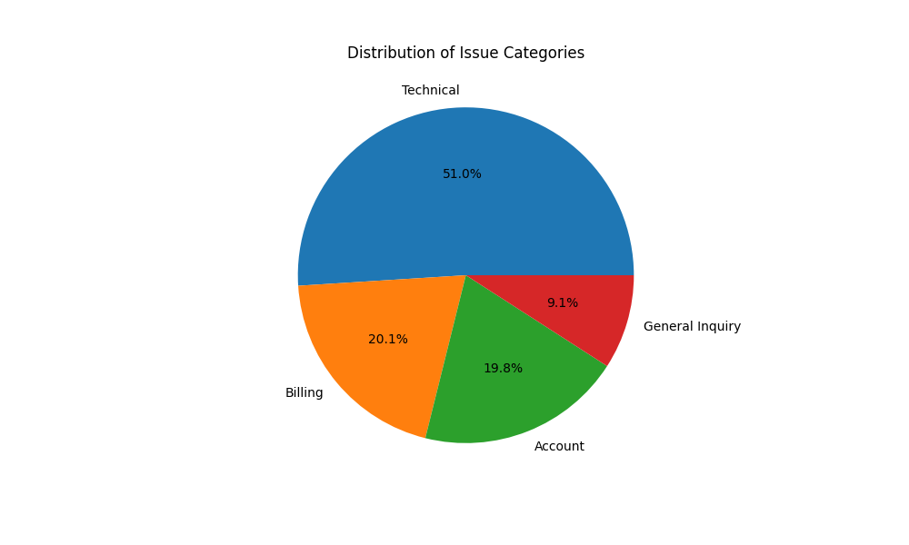
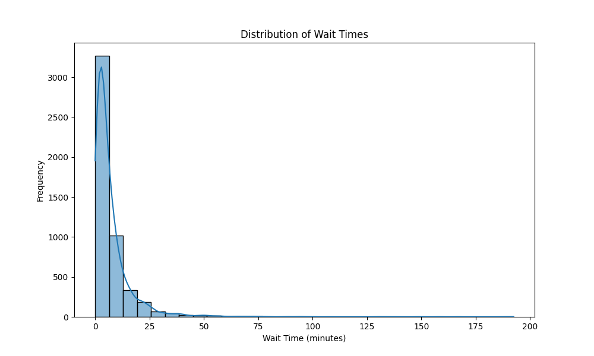
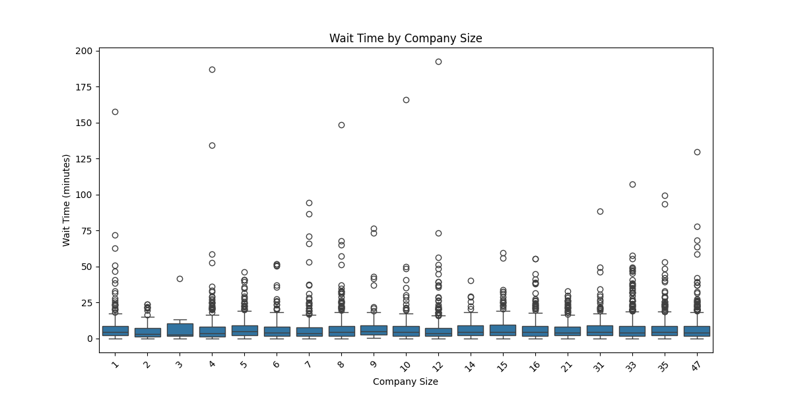
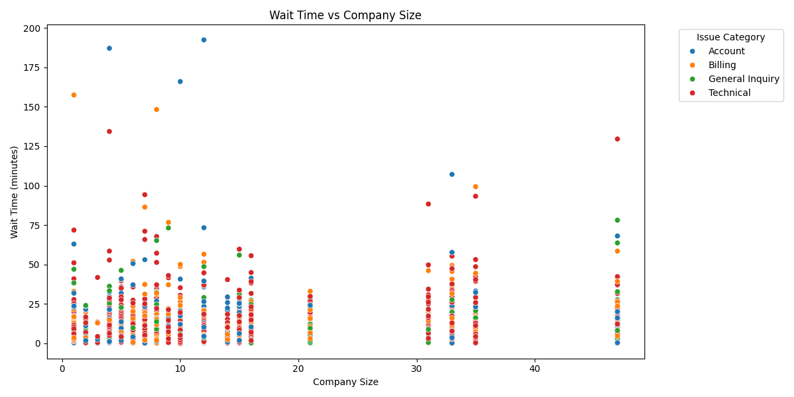

# B2B SaaS company - Customer Support Queue Analysis Report

## 1. Operational Status

### Key Metrics

- **Total Tickets Processed**: `5000`

- **Average Wait Time**: `7.25` minutes

- **95th Percentile Wait Time(Threshold)**: `23.35` minutes

- **Tickets Exceeding Threshold**: `250`

#### Distribution of Issue Categories

## 2. Wait Time Statistics

#### Distribution of Wait Times

#### Wait Time Analysis by Company Size

## 3. High-Value Customer Analysis

For this analysis, we categorize customer companies larger than the median size as high-value customers.

- **Average Wait Time for High-Value Customers**: `7.20` minutes

#### Correlation Between Wait Time and Company Size

## 4. Recommendations for Improvement

- **Implement a Priority Queue for High-Value Customers**: Prioritize support for customers from larger companies to reduce their wait times.
- **Increase Staffing During Peak Hours**: Allocate additional staff during peak periods to manage the higher ticket volumes efficiently.
- **Develop Self-Service Options for Common Issues**: Introduce a knowledge base or chatbot to handle frequently asked questions and routine issues.
- **Enhance Support Staff Training**: Regular training sessions should be conducted to improve the efficiency and effectiveness of the support team.
- **Continuously Monitor and Adjust Wait Time Thresholds**: Implement ongoing monitoring and adjust thresholds as needed to ensure timely support delivery.

## 5. Conclusion

This analysis identifies critical areas for improving customer support operations. Implementing the proposed recommendations will enhance customer satisfaction by reducing wait times, particularly for high-value customers.

## 6. Appendix A: Dashboard

After executing the Python scripts/notebooks, the dashboard is accessible at [http://127.0.0.1:8050](http://127.0.0.1:8050).

### Dashboard Pages:

- **Operational Status**: Provides insights into total tickets, average wait times, and tickets exceeding the wait time threshold. It also includes a pie chart displaying issue category distribution.
- **Wait Time Statistics**: Presents a histogram of wait times and a box plot of wait time by company size.
- **Recommendations for Improvement**: Outlines strategies to reduce wait times for high-value customers, supported by a scatter plot of wait time vs. company size.

Navigation between these pages is available via the top navigation bar on the dashboard.

Alternatively, Tableau dashboard is available at:

## 7. Appendix B: Business questions

### Responses to Key Business Questions:

1. **What is the average wait time for users?**
   - The average wait time is approximately `7.25` minutes.

2. **What is considered "too long" to wait?**
   - The 95th percentile wait time, which is `23.35` minutes, serves as the threshold for excessive waiting.

3. **How many users are experiencing excessive wait times?**
   - A total of `250` tickets exceed the 95th percentile wait time threshold.

4. **How is the problem of excessive wait times distributed among different company sizes?**
   - The average wait time for high-value customers is `7.20` minutes. The distribution of wait times by company size is visualized in the box plot and scatter plot provided above.

- Total Tickets: `5000`
- Average Wait Time: `7.25` minute
- 95th Percentile Wait Time: `23.35` minute
- Tickets Exceeding Threshold: `250`
- Average wait time for high-value customers: `7.20` minutes